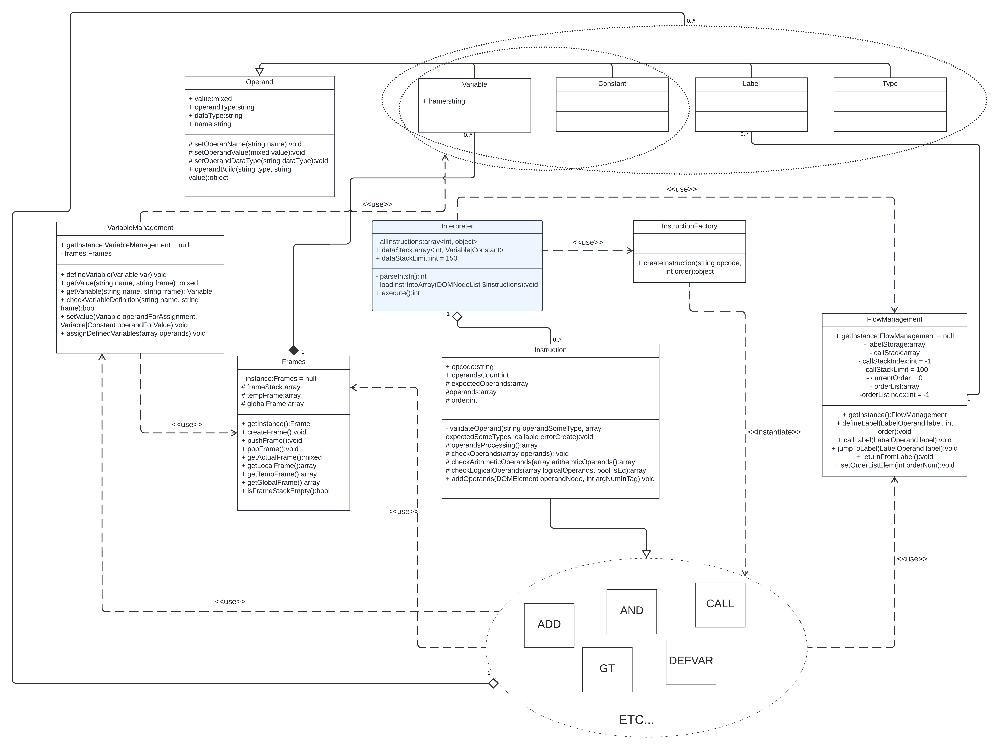

# Interpret XML reprezentace kódu (interpret.php)
## Description 
Project task was to implement interpret, which reads the XML representation of the program and interprets this program using the input according to the command line parameters and generates the output. Language whose interprets by this program is language from IPP subject - **IPPcode24** The project had to be implemented with the help of the existing framework **ipp-code**. The author of this documentation implemented only the part in the folder student. Project is objekt-oriented and has has several reasonably executed patterns.
## Usage 
Program can be run by command `php interpret.php` or `php8.3 interpret.php`, but some arguments are required `--source=file` - file or standart input which contain IPPcode24 program to interpret it, `--input=file` - file or standart input which contain content to be readed while program execution. `--help` basic information about script usage.
> `php interpret.php --source=file --input=file`

At least one of the parameters (--source or --input) must always be specified. If one of them is missing, the missing data is read from the standard input.
## Implementation 
### UML diagram

### OOP suggestion description
Main class of my inplemetation is **Interpreter**. This class Inherits abstract class **AbstractInterpreter** that includes important arguments which contains, for example, link to the file for input. Class **Interpreter** in their implementation use to **InstructionFactory**, **FlowManagement**, **Instruction** classes. It use **InstructionFactory** when program has enough information to decide which class will be created. Then **InstructionFactory** returns one of the childs of **instruction** class which represent one IPPcode24 instruction. (**ADD**, **CALL** etc...).  It's a pattern *Static factory*. Then the class **Interpreter** communicates directly with one of these classes, it is like a pattern *Builder* collects data about the instruction using method `addOperands` of the class **Instruction** . This method call static method `operandBuild()` of the class **Operand** to create right operand based on what XML node info attrubites have. Method `operandBuild()` in class **Operand** also work like a *Static Factory* but in addition, the created classes are inherited from it(There is no need to create another class for the factory). 

After that in construct methods in classes such as **Constant**, **Variable**, **Type**, **Label** we use parent class **Operand**, or rather his methods as *Builder* pattern. 
Instruction classes (**ADD**, **CALL** etc...) use such helpful classes for IPPcode24 instruction execution as **VariableManagement**, **FlowManagement**, **Frames**. All this 3 classes were designed by **Singletone** pattern. Although the specification says that it is undesirable to do this, I think it can be done here. Perhaps it would be possible to make these classes just static methods, although they have their own attributes that are changed using their methods. During the execution of the program these classes are needed in several places, and the same instance is needed in these places, and also these instances of these classes cannot be several because of the nature of the interpreter project. For example, **FlowManagement** class is used in the **Interpreter** to know what is the next IPPcode24 instruction and in the class **CALL** to change current order to jump to another instruction and line.

### Program execution details
My implemented part starts in the method `execute()` class **Interpreter**. At the beggining program takes language node and check it for right language. Then another method `loadInstrIntoArray` starts their action. This method creates instances of IPPcode24 instructions, performs all sorts of checks on the correctness of the XML structure, parse instruction arguments and add it to the **Instruction** child instance. At this stage, the added variables will have nothing to do with the variables already defined and saved in frames. We can say that these are prototypes of variables that already exist(Or will exist DEFVAR instr.). It also gives information to **FlowManagement** about which orders we have in the XML presentation and find and execute **Label** instructions. Then next and final method program call in this class is `parseInstr()` Here program all the time works with **FlowManagement**, take next instruction order in XML presentation if it exists and execute Instruction, for speccific cases it can execute instruction with attributes(input file or stdout). 


Instructions at the beggining of their execution call `OperandsProcessing()` (**Instruction** class) to make a copy and compare added operands with expected operands saved in their attribute `expectedOperands` by `checkOperands()` and other actions. Also at this stage, prototypes of variables are replaced by real ones in the method `assignDefinedVariables()`(**Instruction** class). Arithmetic or logical instructions have additional checks in **Instruction** methods. Instructions during their execution, depending on the nature of the instructions, may operate with different Management instruction or Frame. For example, instruction **PUSHFRAME** need to push temporary variable frame created before. Instruction method `execute()` gets **Frame** instance and make with the mediation of a class **Frames** change frame. This is the principle on which almost all instructions work. Everything that concerns the state of program execution must be done through mediators.

My implemented part ends by returning the received code or by throwing an error while execution. Can return and code from 0 to 9, default is 0, can be changed by EXIT instruction.
## Limitations
The program passes level 6 of the analyser *PHPstan*

My part of the program has restrictions on stack size for security purposes.
```
  Frames stack: 100
  Data stack: 150
  Call stack: 100
```
## Testing 
The correctness of the program was tested by student user tests **IPP_interpret-only_test_2023** downloaded from the faculty Discord Channel. Authorship of the tests is not indicated.
##### Example:
**Test lt_bool**
```
<?xml version="1.0" encoding="UTF-8"?>
<program language="IPPcode24">
    <instruction order="1" opcode="DEFVAR">
    	<arg1 type="var">GF@a</arg1>
    </instruction>
    <instruction order="2" opcode="LT">
        <arg1 type="var">GF@a</arg1>
        <arg2 type="bool">true</arg2>
        <arg3 type="bool">false</arg3>
    </instruction>
    <instruction order="3" opcode="WRITE">
        <arg1 type="var">GF@a</arg1>
    </instruction>
</program>
```
**Expected Output:**
```
false
```
**My output:**
```
false
```
## References
[1] TESAŘ, Lukáš. xtesar43/ipp-core - IPP - PHP Project Core - FIT - VUT Brno - git [online]. [cit. 2024-04-10]. Available at: https://git.fit.vutbr.cz/xtesar43/ipp-core

[2] CHANDLER, Ryan. Writing a (cursed) C interpreter in PHP - Programming Livestream - Youtube [online]. [cit. 2024-04-10]. Available at: https://www.youtube.com/watch?v=4A-zSZ0oXj8&t=658s


